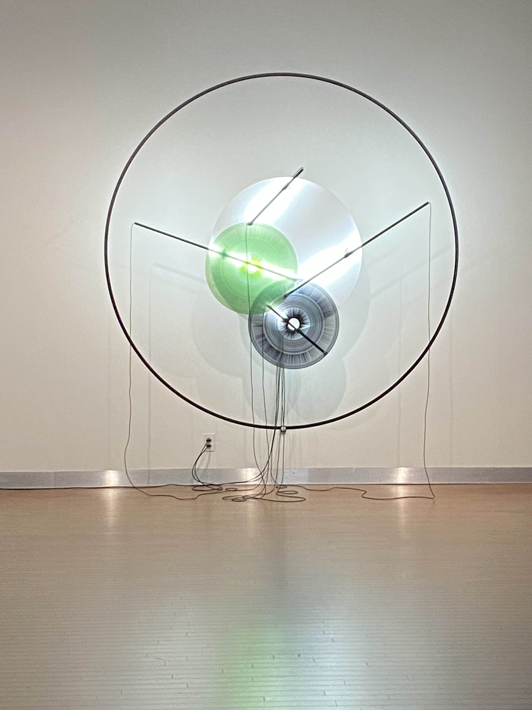
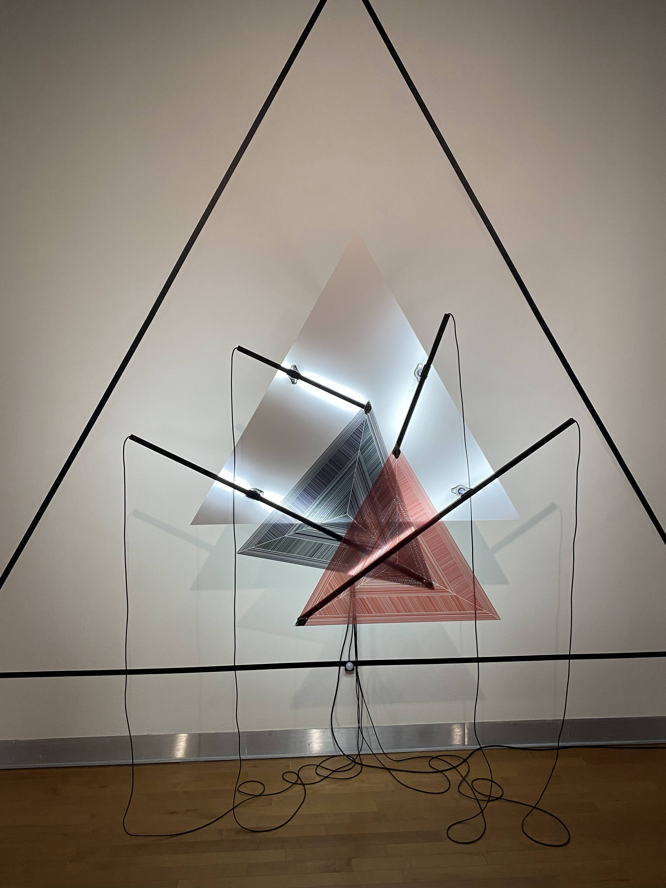
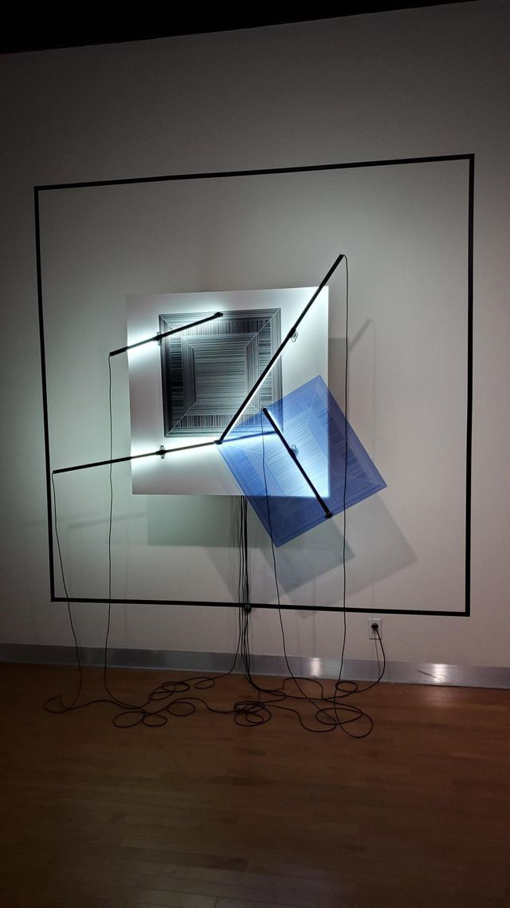
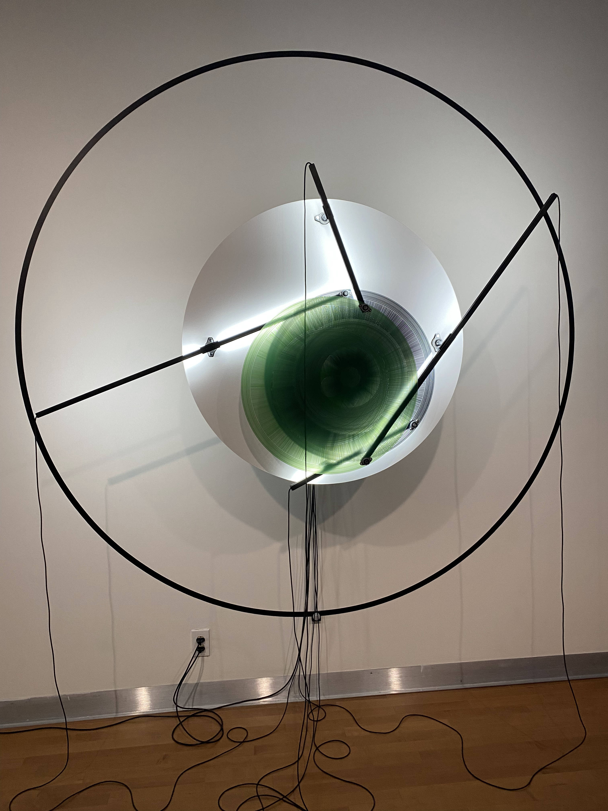
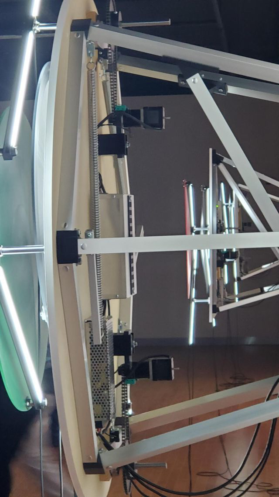
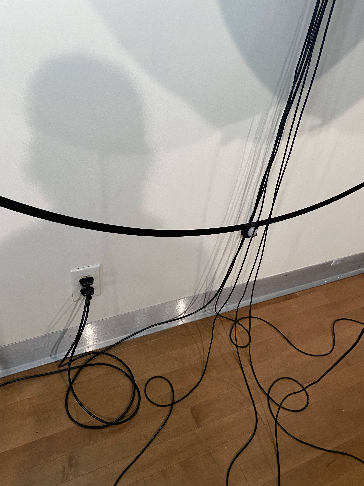
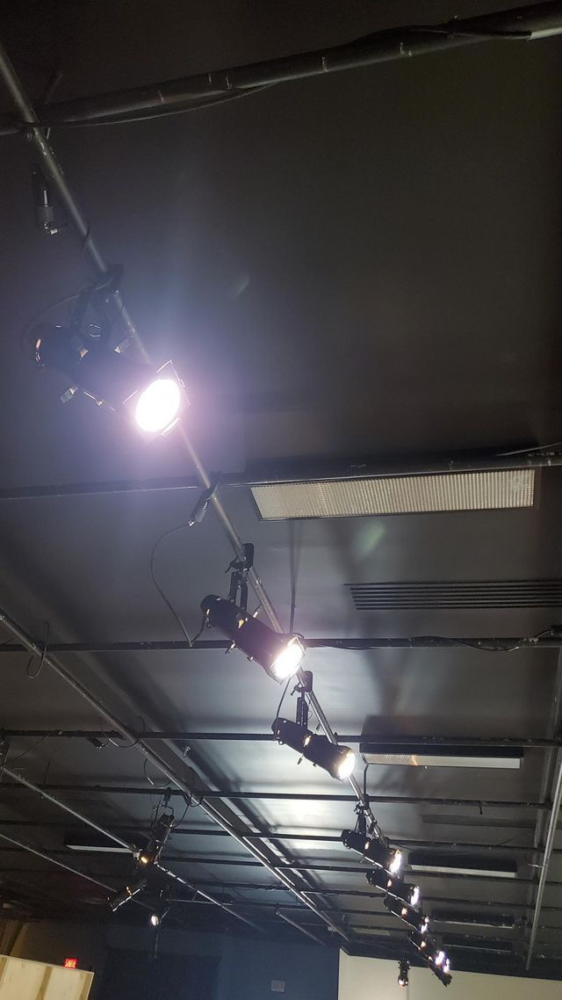
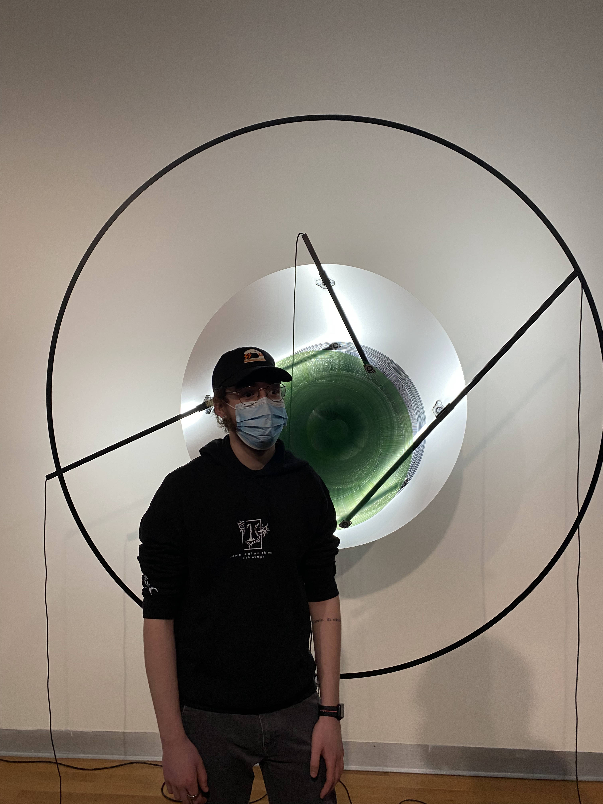
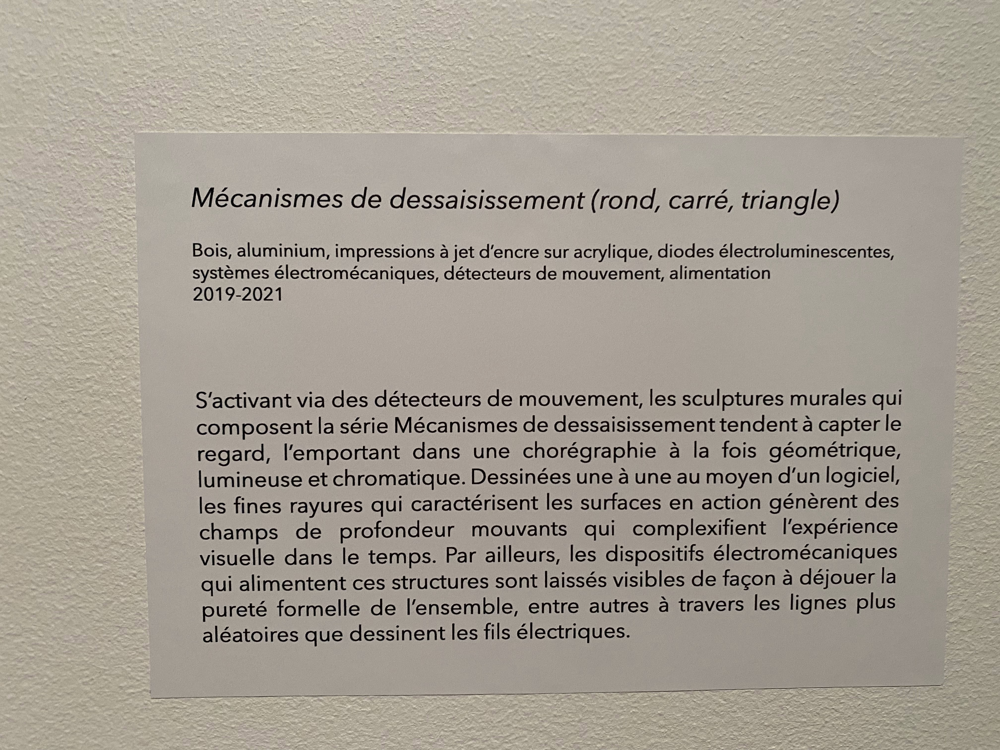

# Mécanismes de dessaisissement (rond, carré, triangle)

 

## Nom de l'artiste ou de la firme
Catherine Béchard et Sabin Hudon

## Année de réalisation
2019-2020 

## Nom de l'exposition ou de l'événement
Béchard Hudon - Configurations du sensible

## Lieu de mise en exposition
Salle Alfred-Pellan 

Maison des arts de Laval

1395, boul de la Concorde O, Laval, Quebec H7N 5W1

## Date de votre visite
22 mars 2022

## Description de l'oeuvre ou du dispositif multimédia 
S’activant via des détecteurs de mouvement, les sculptures murales qui composent la série Mécanismes de dessaisissement tendent à capter le regard, l’emportant dans une chorégraphie à la fois géométrique, lumineuse et chromatique. Dessinées une à une au moyen d’un logiciel, les fines rayures qui caractérisent les surfaces en action génèrent des champs de profondeur mouvants qui complexifient l’expérience visuelle dans le temps. Par ailleurs, les dispositifs électromécaniques qui alimentent ces structures sont laissés visibles de façon à déjouer la pureté formelle de l’ensemble, entre autres à travers les lignes plus aléatoires que dessinent les fils électriques. On peut voir plusieurs formes se déplacer pour déjouer notre perception lorsque l'on reste devant pour l'admirer.

(Ce texte est inspiré du cartel de l'oeuvre)

## Explications sur la mise en espace de l'oeuvre ou du dispositif 
### (texte à composer)
6 enceintes autour de nous transmettent des sons. 
Des transducteurs à l’intérieur d’une boite sur laquelle on peut se poser permet de créer des vibrations.
3 projecteurs ,dont deux accrochés dans les airs par des bâtons, transmettent des images 
sur 3 toiles attachés par des câbles de suspension. 
Les fils sont sur le sol sont accrochés à l’aide de ruban adhésif.

## Liste des composantes et techniques de l'oeuvre ou du dispositif 

- Diodes électroluminescentes
- Bois 
- Aluminium
- Impression à jet d'ancre sur acrylique
- Système électromécanique
- Détecteur de mouvement

(Ce texte est inspiré du cartel de l'oeuvre)

## Liste des éléments nécessaires pour la mise en exposition 

- Fils pour permettre à l'oeuvre de fonctionner
- Structure afin de soutenir l'oeuvre dans les airs
- 9 projecteurs de lumière

## Expérience vécue :

## Description de votre expérience 
### de l'oeuvre ou du dispositif, de l'interactivité, des gestes à poser, etc.

## ❤️ 
### Ce qui m'a plu, m'a donné des idées et justifications

## 🤔 
### Aspect que je ne souhaite pas retenir pour mes propres créations ou que je ferais autrement et justifications

## Références
Cartel de l'oeuvre

