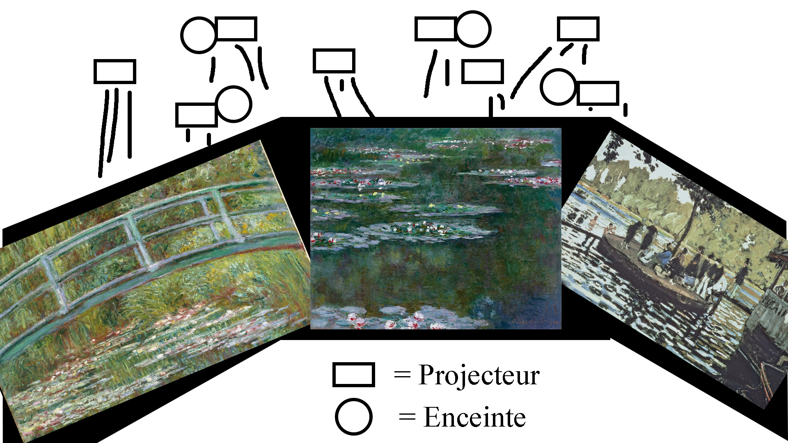

.

# Imagine Monet

## Nom de l'artiste ou de la firme
Annabelle Mauger et Julien Baron (majoritairement)

## Année de réalisation
2022 

## Nom de l'exposition ou de l'événement
IMAGINE MONET

L’exposition immersive

## Lieu de mise en exposition
Arsenal art contemporain 

2020 Rue William, Montréal, QC H3J 1R8 

## Date de votre visite
23 février 2022

## Description de l'oeuvre ou du dispositif multimédia 
Dans le l’espace pédagogique, imaginé par Annabelle Mauger et Androula Michael, des projections vous introduiront à l’univers de Monet. Le premier écran vous permettra de (re)découvrir qui est Monet, sa technique artistique, sa fascination pour les nymphéas et sa démarche vers l’abstraction. Le deuxième écran vous présentera le scénario de l’exposition immersive à travers les grandes périodes qui ont marqué le travail de Monet : Monet et son environnement, les séries et Giverny. Plusieurs projecteurs projetent sur deux écrans et plusieurs enceintes nous font passer de la musique classique. Une oeuvre qui est 100% immersive.

(Ce texte est inspiré du site de l'exposition)

[Imagine Monet](https://www.imagine-monet.com/lexposition/#6)

## Explications sur la mise en espace de l'oeuvre ou du dispositif 

Des enceintes autour de nous transmettent de la musique classique.
Dans un vaste espace rectangulaire, une cinquantaine de projecteurs accrochés dans les airs, 
transmettent des images sur les 4 murs de la pièces ainsi que sur le sol.

## Liste des composantes et techniques de l'oeuvre ou du dispositif 

- ≈50 projecteurs

- Des petites enceintes accrochés au plafond

(je n'ai pas réussi à trouver d'informations sur le nombre)

(Ce texte est inspiré du site de l'exposition)

[Imagine Monet](https://www.imagine-monet.com)

## Liste des éléments nécessaires pour la mise en exposition 

-Fils qui relient les enceinte et les projecteurs à des prises

-Une salle créer pour l'exposition à l'aide de blocs/murs

-Un drap au milieu

## Expérience vécue :

## Description de mon expérience 
### de l'oeuvre ou du dispositif, de l'interactivité, des gestes à poser, etc.
C'est une oeuvre 100% immersive. Je me suis senti aspiré par l'oeuvre. La musique classique m'a transporté dans le temps de Monet. Les oeuvres étaient animées de façon qu'on se sentait presque à l'intérieur d'une oeuvre. J'y suis resté une heure et en tant que fan de peinture je n'ai pas été déçu, mais je peux concevoir qu'une oeuvre aussi contemplative ne soit pas aimé par certaines personnes qui ont du mal à se concentrer.

## ❤️ 
### Ce qui m'a plu, m'a donné des idées et justifications
J'ai beaucoup aimer le fait que l'oeuvre soit immersive. Notre ouie et notre vue est stimulé. Cela rend le tout davantage réaliste. Cela donne aussi davantage le goût de rester et on se sent davantage captivés. L'oeuvre est plus prenante. C'est complexe mais le résultat est très impressionant surtout si le but est de créer une ambiance, une époque ou bien simplement un état.

## 🤔 
### Aspect que je ne souhaite pas retenir pour mes propres créations ou que je ferais autrement et justifications
Pour une de mes oeuvres, je rajouterais de l'interactivité. L'oeuvre n'est pas interactive. Lorsqu'on arrive, on s'asseoit et puis on observe pendant environ 1 heure. C'est une oeuvre basé sur l'observation puisque s'est inspiré du peintre Monet. Cependant, pour l'une de mes créations, je préférais intérargir davantage avec le spectateur afin de garder son attention.

## Références
[Imagine Monet](https://www.imagine-monet.com)

Cartel de l'oeuvre

