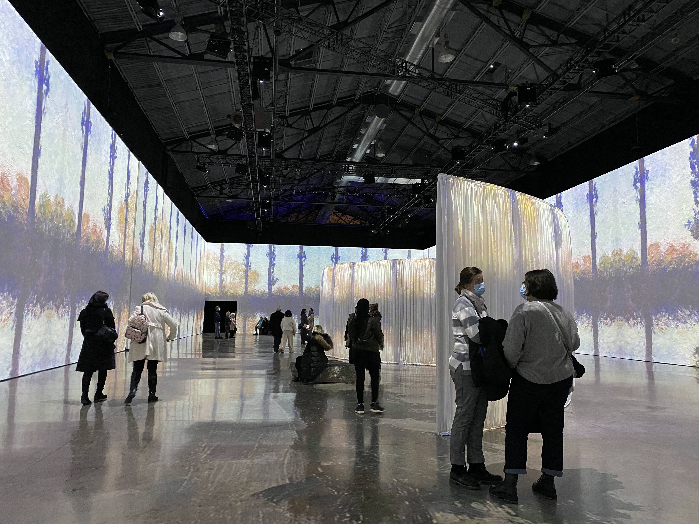
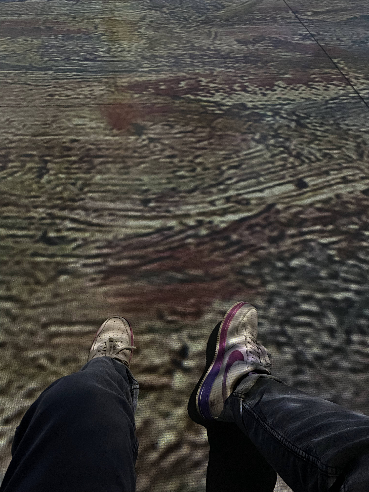
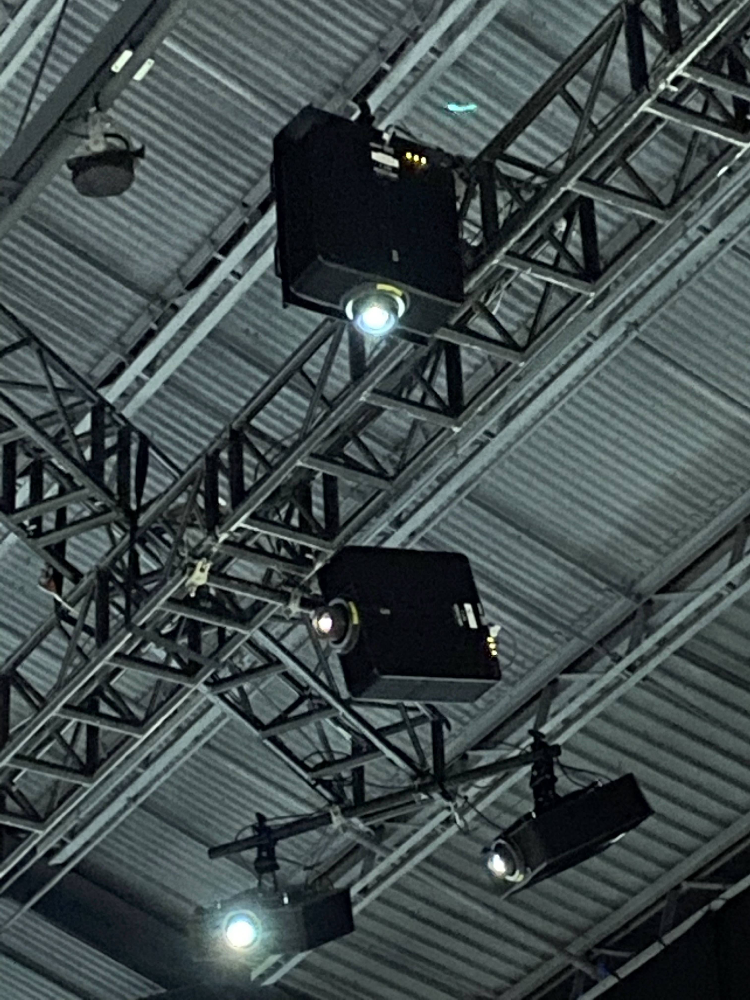
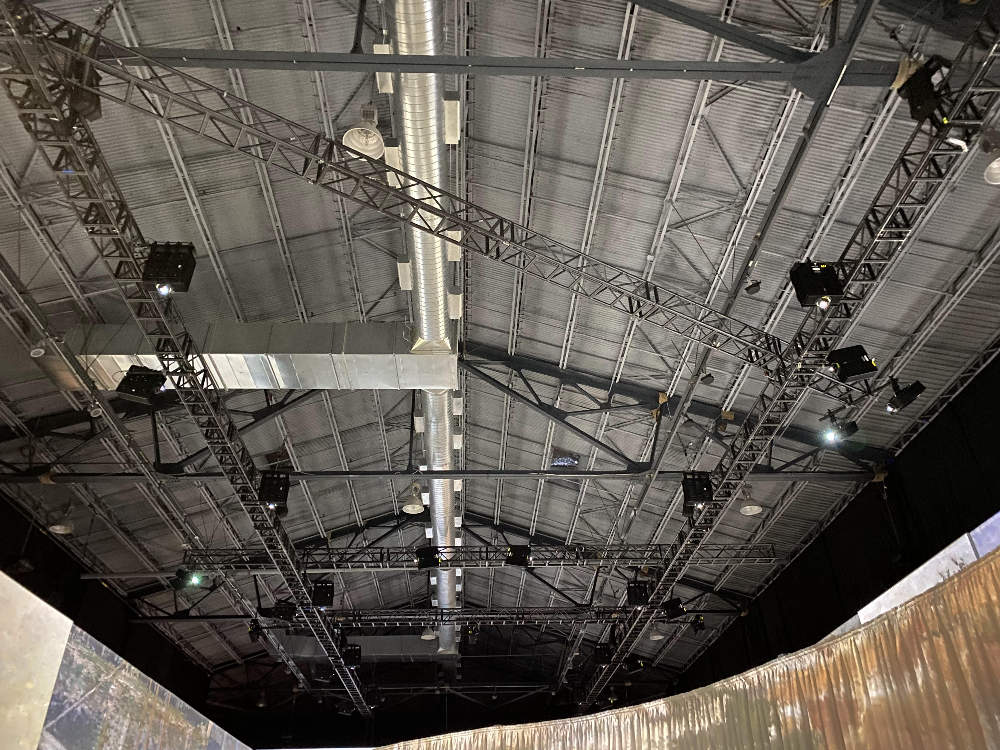
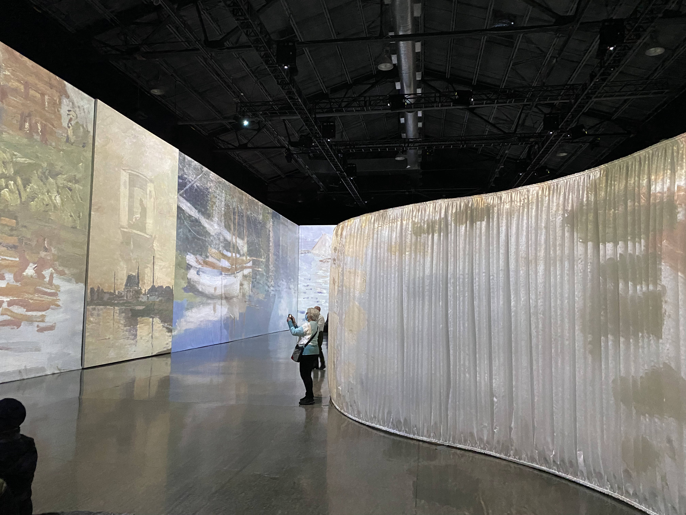
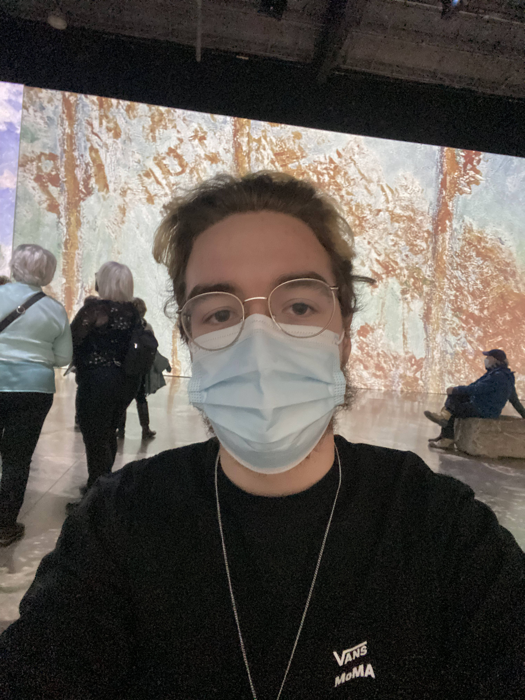
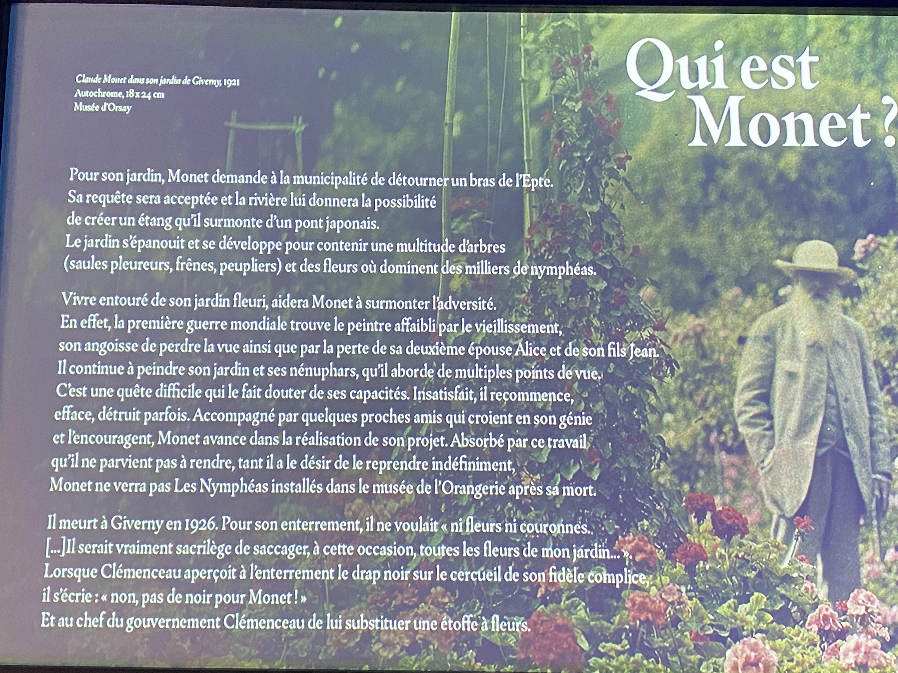
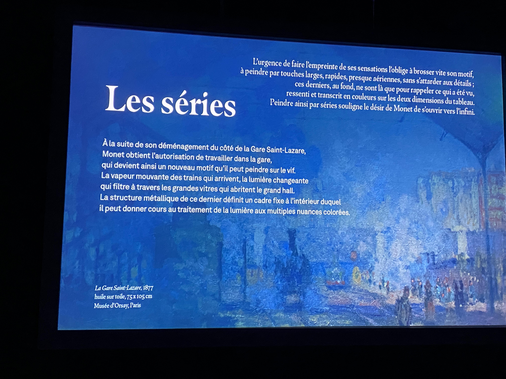
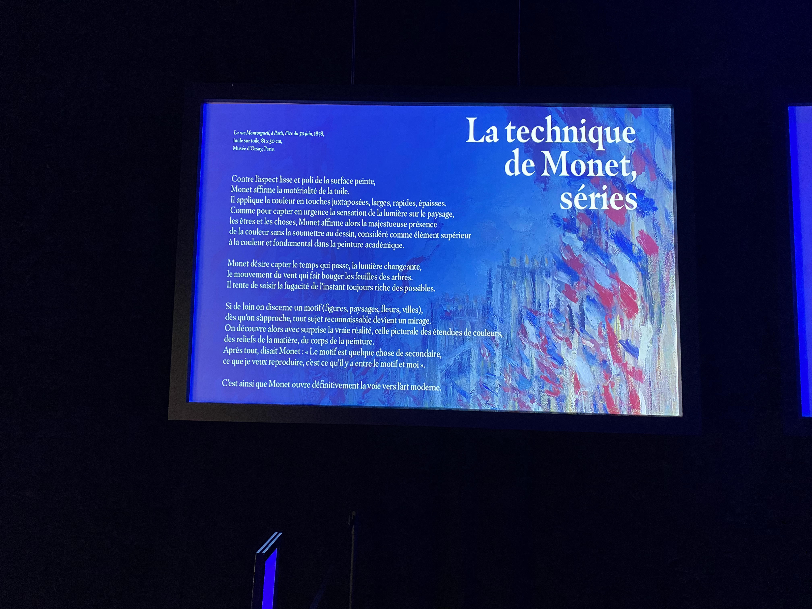

.

# Imagine Monet

 
 
 

## Nom de l'artiste ou de la firme
Annabelle Mauger et Julien Baron (majoritairement)

## Année de réalisation
2022 

## Nom de l'exposition ou de l'événement
IMAGINE MONET

L’exposition immersive

## Lieu de mise en exposition
Arsenal art contemporain 
2020 Rue William, Montréal, QC H3J 1R8 

## Date de votre visite
23 février 2022

## Description de l'oeuvre ou du dispositif multimédia 
Dans le l’espace pédagogique, imaginé par Annabelle Mauger et Androula Michael, des projections vous introduiront à l’univers de Monet. Le premier écran vous permettra de (re)découvrir qui est Monet, sa technique artistique, sa fascination pour les nymphéas et sa démarche vers l’abstraction. Le deuxième écran vous présentera le scénario de l’exposition immersive à travers les grandes périodes qui ont marqué le travail de Monet : Monet et son environnement, les séries et Giverny. Plusieurs projecteurs projetent sur deux écrans et plusieurs enceintes nous font passer de la musique classique. Une oeuvre qui est 100% immersive.

(Ce texte est inspiré du site de l'exposition)

[Imagine Monet](https://www.imagine-monet.com/lexposition/#6)

## Explications sur la mise en espace de l'oeuvre ou du dispositif 

Des enceintes autour de nous transmettent de la musique classique.
Dans un vaste espace rectangulaire, une cinquantaine de projecteurs accrochés dans les airs, 
transmettent des images sur les 4 murs de la pièces ainsi que sur le sol.

## Liste des composantes et techniques de l'oeuvre ou du dispositif 

- ≈50 projecteurs

- Des petites enceintes accrochés au plafond

(je n'ai pas réussi à trouver d'informations sur le nombre)

(Ce texte est inspiré du site de l'exposition)

[Imagine Monet](https://www.imagine-monet.com)

## Liste des éléments nécessaires pour la mise en exposition 
### (ex. : crochets, sac de sable, câbles de soutien...)

-Fils qui relient les enceinte et les projecteurs à des prises

-Une salle créer pour l'exposition à l'aide de blocs/murs

-Un drap au milieu

## Expérience vécue :

## Description de mon expérience 
### de l'oeuvre ou du dispositif, de l'interactivité, des gestes à poser, etc.
Je l'ai trouver enivrant, on pourrait y rester pendant des heures. Nos oreilles ne nous le permettrait pas mais j'aimerais bien. 
On se sent téléporter dans un autre univers. C'est probablement grâce aux images qui ont un lien avec l'espace. 
Je ne saurais dire ce qui est plus captivant entre les images et le son.
C'est probablement le mélange des deux qui rend l'oeuvre intéressante. 

## ❤️ 
### Ce qui m'a plu, m'a donné des idées et justifications
L'impression de se sentir enfermé ou immergé dans l'oeuvre car cela permet de mieux la comprendre et de l'apprécier.
On a l'impression d'être dans l'oeuvre, l'impression d'être vraiment là et cela rajoute de l'impact aux messages et à l'oeuvre.
De plus, ressentir l'oeuvre rajoute un plus, de pouvoir sentir des vibrations. On a encore plus l'impression d'être là.
Je trouve une bonne idée de pouvoir sentir l'oeuvre par plusieurs de nos sens.

## 🤔 
### Aspect que je ne souhaite pas retenir pour mes propres créations ou que je ferais autrement et justifications
La seule chose que je pense aurait rendu l'oeuvre davantage impressionante, c'est si l'artiste avait lui-même créé des images de synthèses 
à la place de prendre des images qui existent déjà. Cela aurait rendu l'oeuvre enrichissante et encore plus impressionante à cause du travail que cela consiste.

## Références
[Imagine Monet](https://www.imagine-monet.com)

Cartel de l'oeuvre

