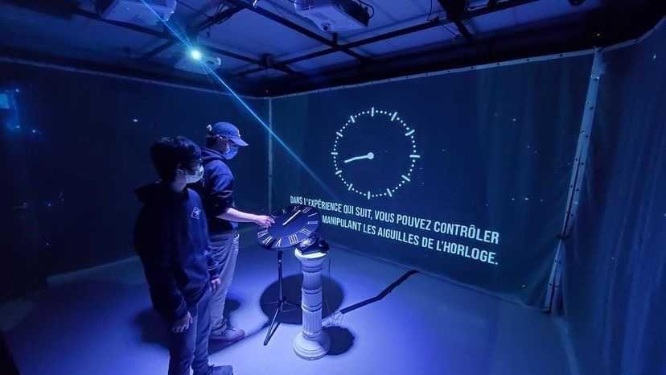

## Les projets ordonnés selon mon ancienne préférence, avec justification

1 = Jeu temporel / Mon concept préféré, j'aime beaucoup l'installation

2 = L'horloge de l'apocalypse / Très beau projet, fasciné par le fonctionnement de l'horloge et du téléphone

3 = 3 minutes / Complexité de créer un jeu vidéo, hâte de voir l'effet du faux casier

4 = Distorsion collective / Envie de voir l'effet d'une caméra 360

5 = Chère Sasha / Intéressé par l'effet de deux ambiances qui se passent en même temps

6 = Chronaufrage / Intéressé par l'animation d'une vraie peinture

## Les projets ordonnés selon ma nouvelle préférence, avec justification

1 = L'horloge de l'apocalypse / Le projet le plus abouti selon moi, démontre très bien l'urgence d'agir, complexe mais très bien fini

2 = 3 minutes / Le casier nous fait vraiment sentir l'angoisse d'un enfant intimidé, le temps est vraiment ressenti de deux manière différente

3 = Chère Sasha / Une sorte de mini jeu d'évasion qui représente très bien la vie d'une personne qui ne sens pas à l'aise chez soi, le décor était vraiment bien fait

4 = Chronaufrage / Le projet qui me semblait le moins intéressant mais l'animation interactive des peintures est très amusant et très bien fait

5 = Jeu temporel / Mon concept qui m'intéressait le plus, cependant le sujet ne m'a pas parut assez développé, l'histoire ne semblait pas avancé et l'ambiance descend d'un coup à la fin

6 = Distorsion collective / La boucle est intéressante, mais répétitive, j'aurais fait durer davantage longtemps la boucle et les rendus n'étaient pas assez fini selon moi

# L'horloge de l'apocalypse

## Nom de l'artiste ou de la firme
Maxime Sabourin, Louis-Philippe Gravel, Alexis Lacasse, Tristan Girard-Montpetit et Maxime De Falco

## Année de réalisation
2022

## Nom de l'exposition ou de l'événement
Moebius

.

## Lieu de mise en exposition
Collège Montmorency

Petit studio

475 Bd de l'Avenir, Laval, QC H7N 5H9

## Date de votre visite
23 mars 2022

## Description de l'oeuvre ou du dispositif multimédia 
### (à composer ou reprendre la description offerte sur le site de l'artiste ou le cartel de l'exposition en citant bien sa source)

## Explications sur la mise en espace de l'oeuvre ou du dispositif 
### (texte à composer)

## Liste des composantes et techniques de l'oeuvre ou du dispositif 
### (ex. : réalité virtuelle, projecteurs, caméra USB, anneau lumineux...)

## Liste des éléments nécessaires pour la mise en exposition 
### (ex. : crochets, sac de sable, câbles de soutien...)

## Expérience vécue :

## Description de mon expérience 
### de l'oeuvre ou du dispositif, de l'interactivité, des gestes à poser, etc.

## ❤️ 
### Ce qui m'a plu, m'a donné des idées et justifications

## 🤔 
### Aspect que je ne souhaite pas retenir pour mes propres créations ou que je ferais autrement et justifications

## Références
https://github.com/MALT5/L-horloge-de-l-apocalypse
